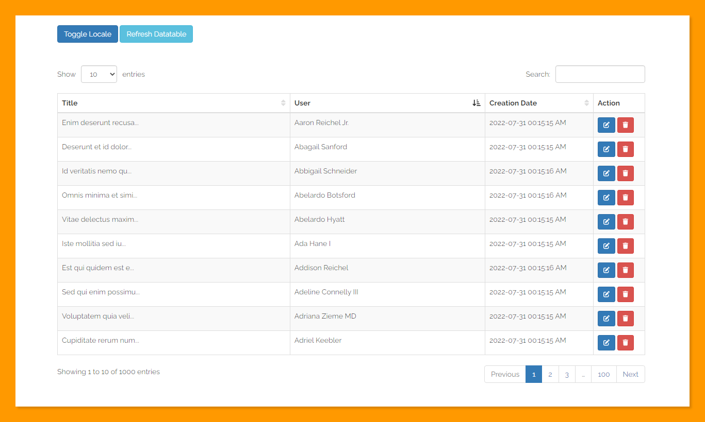

# Laravel Datatables + Vue2

Integrate Laravel Vue Datatable with your Laravel application without using JQuery.



## Installation

```cmd
npm install lv2-datatable
```

## Usage

```js
import Vue from 'vue'
import Datatable from 'lv2-datatable'

Vue.use('Datatable', Datatable)
```

```vue
<template>
  <DataTable
      :axios="axios"
      url="http://127.0.0.1:8000/api/v1/posts/datatable"
      :columns="columns"
      ref="datatable"
      :locale="locale"
      table-id="datatable"
      saved-state
      :data-rows="dataRows"
  >
    <template #action="{ row }">
      <ButtonActions :row="row" />
    </template>
  </DataTable>
</template>

<script>
import axios from 'axios'
export default {
  data () {
    return {
      axios,
      locale: 'en',
      dataRows: [], // non server side data
    }
  },
  computed: {
    columns() {
      return [
        {
          data: "title",
          name: "title",
          title: this.locale === "km" ? "ចំណង់ជើង" : "Title",
          orderable: true,
          searchable: true,
        },
        {
          data: "user.name",
          name: "user.name",
          title: this.locale === "km" ? "អ្នកប្រើប្រាស់" : "User",
          orderable: true,
          searchable: false,
        },
        {
          data: "created_at",
          name: "created_at",
          title: this.locale === "km" ? "កាលបរិច្ឆេទបង្កើត" : "Creation Date",
          orderable: true,
          searchable: false,
          width: "210px",
        },
        {
          data: "action",
          name: "action",
          title: this.locale === "km" ? "ប្រតិបត្តិការ" : "Action",
          orderable: false,
          searchable: false,
          slot: "action",
          width: "100px",
        },
      ];
    },
  },
}
</script>
```
## Props

| Prop          | Type    | Description                                |
|---------------|---------|--------------------------------------------|
| axios         | Object  | Axios instance                             |
| url           | String  | The url to fetch data                      |
| columns       | Array   | Columns to show                            |
| locale        | String  | Localization code ("en", "km")             |
| data-rows     | Array   | Static data of the table                   |
| table-id      | String  | The table ID                               |
| saved-state   | Boolean | Save state of datatable                    |
| lengthOptions | Array   | Dropdown length option                     |
| order         | Array   | Order column and direction                 |
| design        | String  | ["bootstrap3", "bootstrap4", "bootstrap5"] |

## Methods

```js
this.$refs.datatable.refresh()
```
